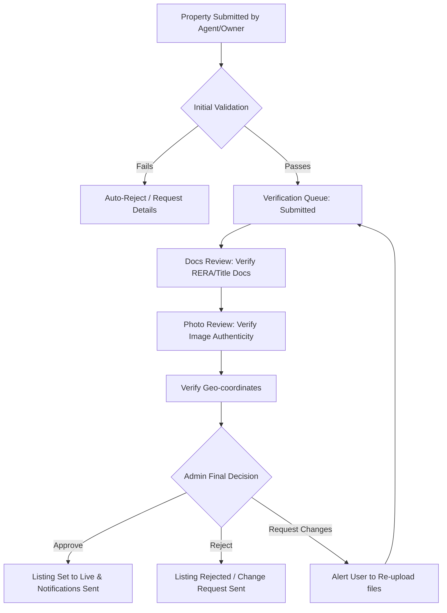

# GHARMB - Backend Architecture & Database Schema Design

This document details the system design, entity relations, data schemas, and API design for the **GHARMB Real Estate Marketplace**. 

---

## 1. Database Schema & Relations (Mongoose Models)

Below are the key Mongoose models backing the platform.

### User Schema (`server/src/models/user.model.js`)
Stores system users across roles (Buyer, Tenant, Owner, Agent, Builder). Contains credential status, profile details, and document upload arrays for verification reviews.
```javascript
const userSchema = new mongoose.Schema({
  name: { type: String, required: true, trim: true },
  email: { type: String, required: true, unique: true, index: true },
  phone: { type: String, unique: true, sparse: true, index: true },
  role: { type: String, enum: ['buyer', 'tenant', 'owner', 'agent', 'builder'], required: true },
  firebaseUid: { type: String, required: true, unique: true, index: true },
  profilePicture: { type: String, default: 'default-avatar.png' },
  isVerified: { type: Boolean, default: false },
  verificationDocuments: [{
    docType: { type: String }, // e.g. 'RERA_LICENSE', 'AADHAAR'
    fileUrl: { type: String },
    uploadedAt: { type: Date, default: Date.now }
  }],
  isActive: { type: Boolean, default: true }
}, { timestamps: true });
```

### Property Schema (`server/src/models/property.model.js`)
Stores listings with geospatial capabilities (`2dsphere` index) to query nearby listings, status flags for administrative review, and analytics tags (views/enquiries).
```javascript
const propertySchema = new mongoose.Schema({
  title: { type: String, required: true, trim: true },
  description: { type: String, required: true },
  type: { type: String, enum: ['rent', 'sale'], required: true },
  propertyType: { type: String, enum: ['apartment', 'house', 'villa', 'commercial', 'land', 'other'], required: true },
  price: { type: Number, required: true, index: true },
  area: { type: Number, required: true },
  bedrooms: { type: Number, default: 0 },
  bathrooms: { type: Number, default: 0 },
  address: { type: String, required: true },
  location: {
    type: { type: String, default: 'Point' },
    coordinates: { type: [Number], required: true } // [longitude, latitude]
  },
  images: [{ type: String }],
  amenities: [{ type: String }],
  owner: { type: mongoose.Schema.Types.ObjectId, ref: 'User', required: true, index: true },
  status: { type: String, enum: ['pending', 'approved', 'rejected', 'sold', 'rented'], default: 'pending', index: true },
  verificationStatus: { type: String, enum: ['unverified', 'in-progress', 'verified'], default: 'unverified' },
  views: { type: Number, default: 0 },
  isFeatured: { type: Boolean, default: false },
  isPremium: { type: Boolean, default: false }
}, { timestamps: true });

propertySchema.index({ location: '2dsphere' });
```

### Builder & Project Schemas (`server/src/models/builder.model.js`, `project.model.js`)
Supports builders organizing structural projects (like new launches), tracking developer credentials and trust quotients.
```javascript
// Builder Schema
const builderSchema = new mongoose.Schema({
  companyName: { type: String, required: true, trim: true },
  reraNumber: { type: String, required: true, unique: true, index: true },
  experienceYears: { type: Number, default: 0 },
  projectsDelivered: { type: Number, default: 0 },
  trustScore: { type: Number, min: 0, max: 100, default: 75 },
  status: { type: String, enum: ['pending', 'approved', 'suspended'], default: 'pending' },
  userAccount: { type: mongoose.Schema.Types.ObjectId, ref: 'User', required: true }
}, { timestamps: true });

// Project Schema
const projectSchema = new mongoose.Schema({
  title: { type: String, required: true, trim: true },
  description: { type: String, required: true },
  builder: { type: mongoose.Schema.Types.ObjectId, ref: 'Builder', required: true, index: true },
  location: {
    type: { type: String, default: 'Point' },
    coordinates: { type: [Number], required: true }
  },
  status: { type: String, enum: ['draft', 'pending', 'published', 'archived'], default: 'draft' },
  investmentScore: { type: Number, min: 0, max: 10, default: 5 },
  amenities: [{ type: String }],
  gallery: [{ type: String }],
  floorPlans: [{ title: String, area: Number, image: String }]
}, { timestamps: true });
```

### Referral & Coins Wallet Schemas (Fintech System)
Manages user referral codes and balances. Users earn coins (e.g. on registration or successful listing) and redeem them to boost property exposure.
```javascript
// Coin Wallet Schema
const coinWalletSchema = new mongoose.Schema({
  user: { type: mongoose.Schema.Types.ObjectId, ref: 'User', required: true, unique: true, index: true },
  balance: { type: Number, default: 100, min: 0 }, // Initial signup coins
}, { timestamps: true });

// Coin Transaction Schema
const coinTransactionSchema = new mongoose.Schema({
  wallet: { type: mongoose.Schema.Types.ObjectId, ref: 'CoinWallet', required: true, index: true },
  amount: { type: Number, required: true }, // positive for credits, negative for debits
  type: { type: String, enum: ['referral_credit', 'signup_bonus', 'listing_boost', 'admin_adjustment'], required: true },
  description: { type: String },
}, { timestamps: true });
```

### Token Request Schema (Fintech escrow)
Allows buyers to pay a refundable "Token Deposit" to hold a property or book a site visit escrow. Money is held in trust and approved/refunded by the admin.
```javascript
const tokenRequestSchema = new mongoose.Schema({
  buyer: { type: mongoose.Schema.Types.ObjectId, ref: 'User', required: true, index: true },
  seller: { type: mongoose.Schema.Types.ObjectId, ref: 'User', required: true },
  property: { type: mongoose.Schema.Types.ObjectId, ref: 'Property', required: true, index: true },
  amount: { type: Number, required: true },
  status: { type: String, enum: ['pending', 'approved', 'rejected', 'refunded'], default: 'pending', index: true },
  transactionId: { type: String, required: true }, // Razorpay payment ID
  refundTransactionId: { type: String }
}, { timestamps: true });
```

---

## 2. API Design & System Routes

### Verification Center Workflow
- **`GET /api/v1/admin/verification/queue`**: Fetch properties awaiting approval.
- **`POST /api/v1/admin/verification/:id/stage`**: Advance verification workflow stage.
- **`PATCH /api/v1/admin/verification/:id/approve`**: Mark property verified and set status to Live.
- **`PATCH /api/v1/admin/verification/:id/reject`**: Reject property listing with formal correction remarks.

### Fintech Token Manager
- **`GET /api/v1/admin/tokens`**: Fetch transaction log with status filters.
- **`POST /api/v1/admin/tokens/:id/escrow-approve`**: Release token money to the listing seller.
- **`POST /api/v1/admin/tokens/:id/refund`**: Trigger Razorpay refund API and mark status as refunded.

---

## 3. Administrator UX Flow Chart

The diagram below maps the typical action loop for verification and moderation:


